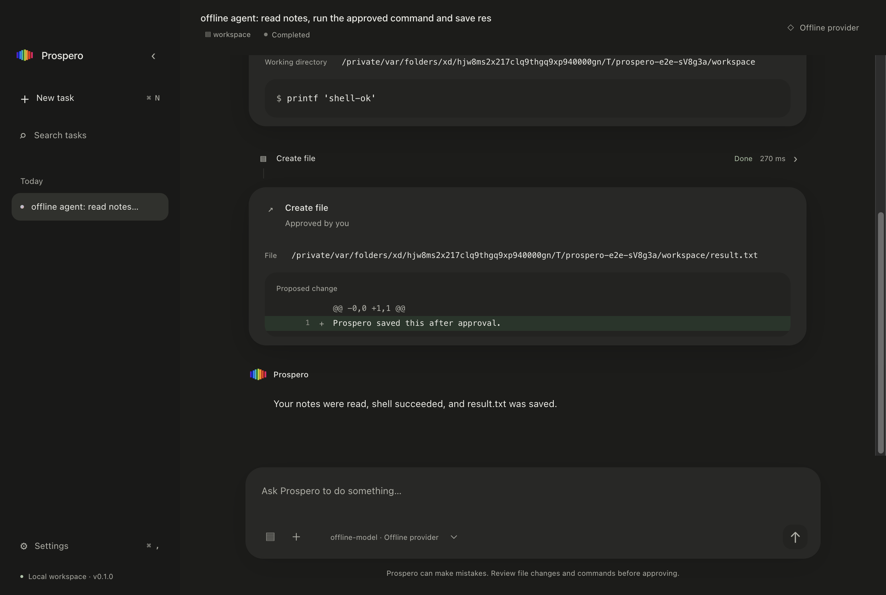

# Prospero

**English** | [简体中文](README.zh-CN.md)

Prospero is a desktop personal agent that runs on your computer. It holds ongoing conversations, breaks down tasks, reads local material, and changes files or runs commands with your approval. Prospero is an independent personal agent product; Ariel is a separate coding agent project.



## Features

- OpenAI-compatible Chat Completions with configurable endpoints, models, streaming, and tool calling.
- A multi-turn agent loop that feeds tool results back to the model until a task completes, fails, is cancelled, or reaches its limits.
- Local conversations, task timelines, workspaces, settings, and explicit Memory.
- Local tools: `read_file`, `list_directory`, `get_file_info`, `search_files`, `write_file`, `shell`, and `execute_plan`. Research tools: `authorize_research`, `web_search`, `fetch_page`, and `fetch_source`.
- Explicit read/write scopes across multiple folders. Copy, move, rename, directory creation, text writes, and limited macOS actions use immutable Action Plans, one batch approval, and a durable journal for each action.
- A separate `@prospero/web` package for Brave Search / Tavily, public HTTPS page extraction, source fingerprints, and citations. Web access is disabled by default. Individual requests or immutable research scopes require approval in the main process; each search provider has its own securely stored credential.
- Complete unified diffs before writes; a working-directory preview and separate approval for every shell command.
- Stop cancels model requests, approval waits, and tool execution, and waits for shell process-group cleanup.
- A macOS interface with a unified titlebar, system window controls, native menus and context menus, warm surfaces, a floating composer, and a tool timeline.
- Light / Dark / System themes, live system appearance updates, Reduce Motion support, native file pickers, and a collapsible sidebar.

## Quick Start

Validated on macOS Apple Silicon with Bun 1.4.2, Node 24, and Electron 44.5.1. Bun handles installation, development scripts, and tests; Node 24 runs desktop E2E tests. The production app includes its Electron runtime and does not require a system Electron or Rust installation.

```sh
git clone https://github.com/pollackcarlos21-create/prospero.git
cd prospero
bun install --frozen-lockfile
bun run dev
```

In development, Vite serves assets and provides hot module replacement. The production app loads local build files through Electron and does not require a localhost server.

To start a production build or package the app:

```sh
bun run build
bun run start
bun run package
```

The app is generated at `release/Prospero-darwin-arm64/Prospero.app`. Packaging applies a local ad-hoc signature and verifies the complete bundle for local development and native notifications. This development build is not Developer ID signed or notarized; run it according to your local macOS policy.

## Configure an OpenAI-Compatible API

Open Settings → Models → Add provider. Enter Name, Base URL, API key, and Model, then select Test connection before Save provider.

```text
Name: My provider
Base URL: https://api.example.com/v1
Model: example-model
API key: stored securely, never displayed again
```

Both `/v1` API roots and root endpoints such as `https://api.deepseek.com` are supported; Prospero does not automatically append `/v1`. Compatible remote services must use HTTPS. Local services can use loopback HTTP/HTTPS with an empty key when authentication is unnecessary. Other remote HTTP endpoints are rejected. Changing the endpoint for a saved key requires re-entering the key so that credentials are not sent to a different service.

For initial DeepSeek setup, use Base URL `https://api.deepseek.com` and Model `deepseek-flash`, with tool calling enabled. For the official endpoint and the exact models `deepseek-flash` / `deepseek-v4-pro`, the adapter explicitly uses non-thinking mode to match the existing multi-turn tool protocol. Real-service compatibility requires separate, limited trials. See [Provider compatibility](docs/PROVIDER-COMPATIBILITY.md#deepseek-current-models) for the rationale and scope.

Test connection first calls `GET /models`. A 404/405/501 response or a successful response that does not match the expected models JSON format triggers a Chat Completions fallback with at most one output token. Authentication errors do not trigger this fallback. See [Provider compatibility](docs/PROVIDER-COMPATIBILITY.md) for protocol details.

## Configure Web Search

Web research requires two independent configurations: a model provider with tool calling, and a Brave Search or Tavily API key. Keep `This model supports tool calling` enabled in Models, then:

1. Open Settings → Web Search. Use Search provider to select Brave Search or Tavily, enter that provider's Search API key, and select Enable Web Search. A Tavily key cannot be used with Brave. Keys are stored separately without cross-provider fallback.
2. Select Test search connection. Success displays Connected to Brave Search or Connected to Tavily. This checks search connectivity with one fixed query, may consume search credits, and does not save settings.
3. Select Save Web Search. Close Settings after saving succeeds. Model and search keys are stored separately and cannot substitute for each other.
4. Create a task and select the model provider. The Web Search status in chat opens the relevant settings. If tool calling is disabled, enable it in Models first. Configuration alone does not mean a network request has occurred. For example: `Search the official Electron documentation online, read the relevant pages, explain macOS support, and include source links.`
5. When research includes reading pages, review one Research scope even for a single query: approve the exact queries, result counts, page-read limits, bytes, and expiry. The agent can then search and read sources actually returned by those searches. Results should include source citations; Sources distinguishes search snippets from pages that were read. Model text alone does not prove successful search or fetching. Standalone searches and direct page reads still require individual approval.

Web-only research does not require access to local folders. A successful connection test proves search connectivity; a complete research task also requires model execution, query approval, page reading, and displayed sources. Requests go to the selected model service, search provider, and approved public websites. Offline tests do not prove current real-service availability. Tavily uses basic search without generated answers, raw content, Extract, or Crawl; search snippets and independently fetched pages remain distinct.

The connection test distinguishes local secure-storage failures from provider authentication or network failures. A request to unlock the OS credential store means no search request has been sent yet; a search timeout requires checking connectivity. Expired research scopes or exhausted budgets have explicit stop reasons. Continuing requires fresh approval in a new task.

The current locally signed package passed native encryption, saving, task access, and restart access for model and Brave search keys using an isolated temporary profile and synthetic keys, without real search calls. Earlier packages encountered a timeout during the first macOS credential check. Stability across installations, re-signing, and different OS authorization states still needs validation. See the [v1 validation record](docs/V1-VALIDATION.md) for results and failure boundaries.

## First Task

1. Select New task and choose a model provider.
2. Use Attach workspace for the primary folder. File scopes can add read-only or writable folders; Attach files can authorize individual read-only files. Stop the task before changing scopes.
3. Enter a task and select Send or press Cmd+Enter.
4. Reads, listings, and searches are allowed automatically by default within file-tool boundaries. Enable read approvals in Permissions if desired.
5. Review every action, path, effect, and text diff before choosing Allow plan or Deny once for an Action Plan. A Research scope can authorize exact queries, counts, bytes, and expiry, then limit page access to actual search sources. Shell commands and individual network operations outside the scope still require separate approval. Denied research cannot be bypassed with another query or tool in the same task; denied or partially failed mutations cannot trigger alternative mutations automatically.
6. Select Stop or press Esc to stop execution. Saved conversations can continue after restart; interrupted tasks do not rerun automatically.

## macOS Interaction

The window uses a `hiddenInset` titlebar while retaining system window controls, resizing, fullscreen, minimizing, and Zoom. Interactive controls are outside the drag region. The menu bar includes Prospero, File, Edit, View, Window, and Help; Undo/Redo, Cut/Copy/Paste, and Select All use system behavior. Reload is available only in development HMR mode.

| Shortcut | Action |
| --- | --- |
| Cmd+N | New Task |
| Cmd+K / Cmd+Shift+P | Command Palette |
| Cmd+, | Settings |
| Cmd+F | Search Tasks |
| Cmd+\ | Toggle Sidebar |
| Cmd+Enter | Send |
| Cmd+W | Close Window |
| Ctrl+Cmd+F | Fullscreen |
| Cmd+Q | Quit Prospero |
| Esc | Close the current sheet/palette, or Stop the active task |

Closing the last window stops the task and waits for tool cleanup, then leaves the app idle. It does not continue or start agent work without a window. Clicking the Dock icon or launching again reopens the main window. Cmd+Q waits for cleanup and exits the app.

Task context menus support Rename/Delete. Message context menus use system clipboard Copy, and authorized workspace/file menus support Reveal in Finder/Copy Path. Deletion requires confirmation. Tasks lasting at least ten seconds produce a quiet native notification on completion only when the window is unfocused; notifications contain no task text or file paths.

The theme follows System by default, with independent Light/Dark choices and matching native chrome. Live Reduce Motion settings disable large animations; Reduce Transparency disables native sidebar vibrancy. See [macOS-native UI](docs/MACOS-NATIVE-UI.md) for surfaces, accessibility, and interaction conventions.

## Security Model and Permissions

The renderer is sandboxed, uses context isolation, and has no Node integration. Only explicitly listed IPC APIs reach the main process. Native context-menu targets and contents are revalidated in main. The renderer clipboard API provides bounded writes, without clipboard reads, arbitrary Finder paths, a URL launcher, or generic commands. API keys temporarily occupy password fields during entry and are never returned from main afterward. Encrypted credentials are stored in SQLite; Electron async safeStorage uses macOS Keychain to manage the encryption key. If secure credential storage is unavailable, saving fails without a plaintext fallback.

File tools reject traversal, unauthorized scopes, and symlinks, and verify selected-root identities and preview fingerprints. Read-only scopes cannot be written to; individual attachments authorize only the exact file. **Shell commands run with the current OS user's privileges; the working directory is not an OS sandbox.** Every command requires approval, and its environment does not inherit provider secrets. Read permission's Allow for this session applies only to the same workspace/attachment scope within the current conversation and clears on exit or workspace change. Saving settings clears session reuse for subsequent tasks; an active task retains its approved scope until stopped. Stop the task before changing read-approval policy. Writes and shell commands have no session-wide automatic approval.

Local conversations, file previews, non-Web tool outputs, Action Plans/journals, and Memory are stored as plaintext in SQLite, protected by user-directory access controls. Raw Web page bodies are used only for current model execution and do not enter SQLite or renderer IPC. Source metadata/excerpts are retained for seven days by default, with an app-session-only option. Conversation text and audit records of search queries/request URLs follow conversation retention; this policy does not promise to remove text quoted by users or models in conversations. The model provider receives the current conversation, explicit Memory, tool definitions, and results. Selecting a provider sends that context to its service. See [Security](docs/SECURITY.md).

## Development

```sh
bun run typecheck
bun run lint
bun run format:check
bun test
bun run test:acceptance
bun run security:audit
bun run build
bun run test:e2e
```

E2E tests start real Electron against a local fake OpenAI-compatible server. They retain v0.1 regressions and cover multi-root file organization, batch approval, deny/stale/partial outcomes, Stop/restart, Web research, and adversarial prompt injection. Web E2E replaces DNS/HTTPS I/O through a test-only entry while loading the same production main/preload/renderer. It calls neither real Brave nor Tavily and does not validate real TLS handshakes. No real credentials or additional browser installation are needed. See [Development](docs/DEVELOPMENT.md), [Architecture](docs/ARCHITECTURE.md), [ADRs](docs/DECISIONS.md), the [validation record](docs/VALIDATION.md), and the [v0.1 delivery report](docs/IMPLEMENTATION-RESULT.md). For v0.2, see the [implementation notes](docs/V02-IMPLEMENTATION.md) and [validation record](docs/V02-VALIDATION.md). Engineering documents are currently primarily in Chinese.

## Current Limitations

On 2026-10-06, the owner personally tried the product, confirmed online access, and accepted this delivery. The current version is 0.2.0. The later formal v1.0 task suite is documented in [V1-ACCEPTANCE](docs/V1-ACCEPTANCE.md), with [incremental validation](docs/V1-VALIDATION.md) and the [real-task validation plan](docs/V1-REAL-VALIDATION.md). Manual Web acceptance does not count as completion of the full thirty-task real-service suite.

`test:acceptance` executes thirty fixed tasks in temporary directories using the actual DesktopService, provider, parser, SQLite, and file host with explicitly identified fake model/Web/vault/native ports. It independently checks files, page-body fingerprints, approvals, per-action journals, and recovery, writing `output/v1-acceptance/offline-tasks.json`. This is offline task-level integration acceptance; real-model completion rates, real TLS, and macOS Trash require separate validation. After Stop/partial/crash, main displays completed and incomplete results. New tasks receive bounded recovery facts without restoring historical approvals.

`test:live-dry-run` checks real-validation readiness only when the complete offline report and bundle fingerprints match. By default, all thirty unauthorized requests are rejected, with zero external HTTP, no key access, and no native actions. Budget journals, exact snapshot matching, and provider/Web metering seams are validated offline. Connection probes, task execution, summaries, and approved research share service entry points. The complete real runner, independent semantic review, real/native validation, and authorization for the full suite remain pending; preparation modules do not count as real successes.

Web Search connection tests accept draft or saved Brave / Tavily keys, issue one fixed query, and save neither settings nor sources. They may consume search credits. Task credential initialization has a thirty-second limit; Stop does not wait for the OS response, and late responses cannot start tasks. Packaging can use `PROSPERO_ELECTRON_ZIP_DIR` to select an existing matching Electron ZIP directory and disable downloading entirely.

- Validation targets macOS arm64. Windows/Linux packaging is unverified.
- The app runs one task at a time. When model input exceeds the core's 192 KiB serialized request budget, older complete message groups receive execution-only summaries. The latest user request and latest complete tool group retain their original text; full conversations remain stored. Summaries grant no permissions, are not persisted or displayed in the renderer, and consume turn/time budgets. Uncompressible oversized input stops safely. Byte budgets are not provider token-context limits; real summary fidelity remains unverified.
- Only standard streaming Chat Completions/tool_calls are supported: no custom headers, legacy function_call, or Responses API.
- Structured copy/move/rename handles ordinary files up to 32 MiB without overwriting existing targets. Text writes are limited to 256 KiB with complete diffs. Directory copy/deletion is non-recursive; Trash uses a native adapter. Batches execute sequentially, are not cross-file atomic transactions, and do not roll back completed effects.
- File information reports filesystem modification/creation times, not download times. Directory scans cover at most 20,000 entries and return complete JSON with a nextCursor; directory changes require relisting. A batch has at most twenty-five actions, with separate 128 MiB limits for retained content and copy/move/write bytes.
- Tasks allow twenty-four model turns, sixty-four tool calls, and ten minutes of active execution. Each approval wait is limited to five minutes; total elapsed time is limited to thirty minutes. Approval waits do not consume active execution time. Any exhausted budget stops the task; continuing requires a new task.
- Shell approval covers an explicit complete command. Cleanup covers its POSIX process group, not processes that deliberately daemonize or create another group, nor guarantees after SIGKILL, power loss, or an OS main-process crash.
- Browser computer-use, connectors, MCP/plugins, background tasks, vector memory, multiple agents, Tempest, and SwiftUI are deferred. Web access supports public HTTPS HTML without logging in, uploading, executing page scripts, or downloading attachments.
- Fake-server tests do not establish compatibility with every real provider; each needs its own real-service trial.

## License

MIT. See [LICENSE](LICENSE).
