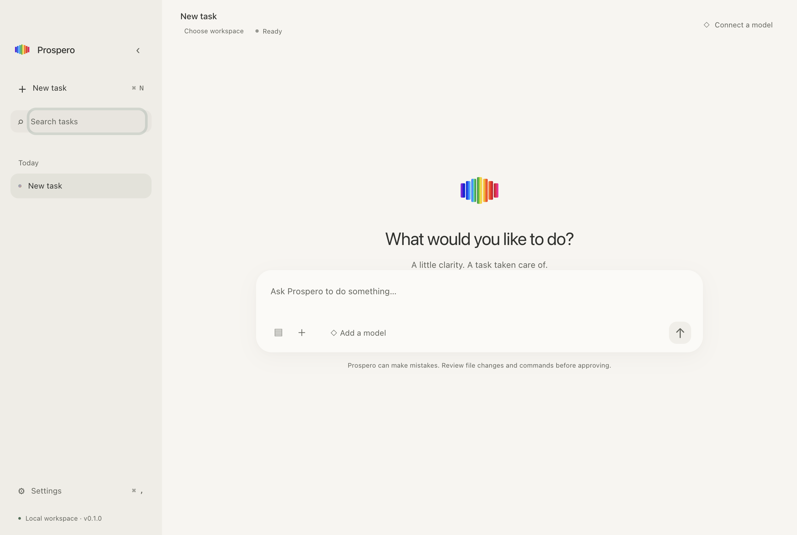
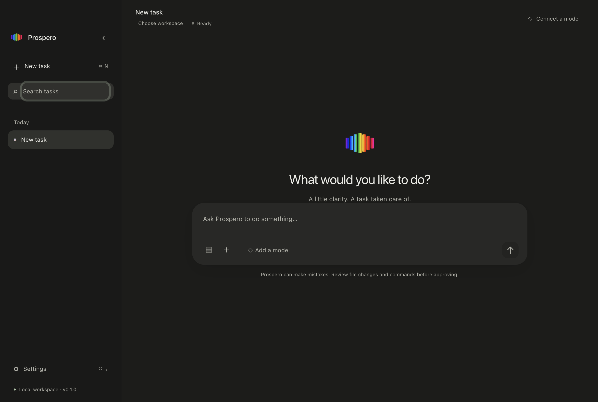
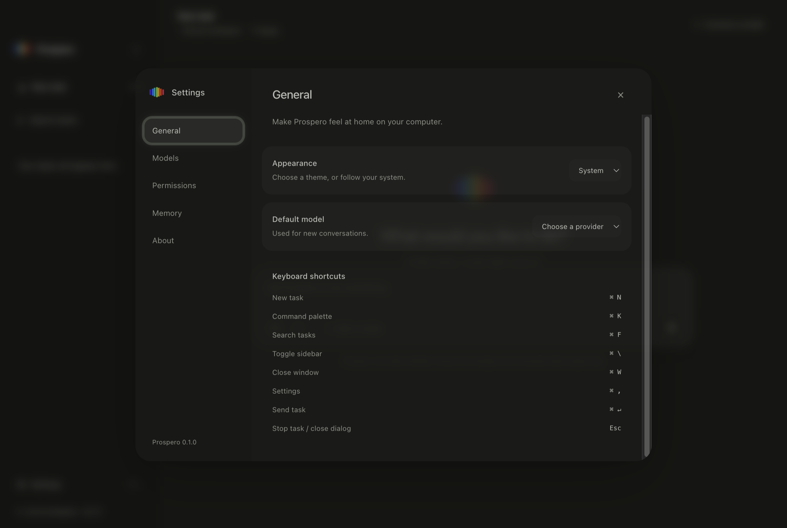
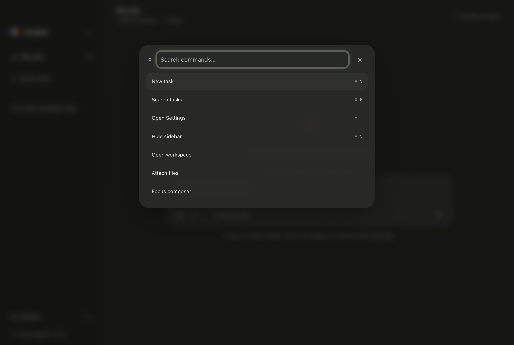

# macOS-native UI 与交互验收

Prospero 优先遵循 macOS 的窗口、菜单、键盘和系统服务约定。视觉采用克制的圆角几何与暖色 material，普通状态保持简洁；工具详情、审批、diff 和高级设置按需要展开。Dock 与应用内品牌标识统一采用用户提供的七条圆角 spectrum bars。原始透明 PNG bytes 嵌入 `assets/icon.svg`，八处应用内 Mark 共用同一 SVG；Dock 从该 SVG rasterize 为 ICNS。SVG viewport `240 128 1056 768` 仅裁去展示用透明留白，不重绘或修改原图像素。来源 hash 核验见 `output/validation/icon-provenance.log`。没有 bundle Apple 字体文件。

## 实际设计 tokens

Tokens 定义于 [styles.css](../apps/desktop/src/renderer/styles.css)。主要区域没有可见框线，层次由轻微背景差异、留白和少量浮层阴影表达。

| Token | Light | Dark | 用途 |
|---|---|---|---|
| `surface-base` | `#f7f5f0` | `#1c1c1a` | 可读、不透明的主内容区域 |
| `surface-sidebar` | `#efece6` | `#191917` | 轻微区分的导航 material |
| `surface-raised` | `#f0eee8` | `#232321` | 低层次输入与列表 surface |
| `surface-floating` | `#fbfaf6` | `#282826` | composer 与交互审批 |
| `surface-overlay` | `#faf8f3f5` | `#292927f7` | palette、sheet 与 popover |
| `text-primary` | `#30312e` | `#ecece6` | 正文 |
| `text-secondary` | `#62645c` | `#b0b0a7` | 次要说明 |

- 圆角：control 10px、selection 12px、card 16px、panel/modal 24px；小图标容器 8px。
- 间距：4、8、12、16、20、24、32、40px。快捷键列表保留 24px gap，按键标签不缩小。
- 字体：`-apple-system`、`BlinkMacSystemFont`；代码使用 `ui-monospace`、SF Mono-compatible fallback。标题以 regular/medium 为主。
- 动画：200ms ease-out；浮层入场 180ms、5px 轻微位移。Reduce Motion 关闭 transition、animation 和 smooth scrolling。
- Spectrum：用户提供的彩色标识用于 logo、Welcome、About 和 agent 标识；微小 active marker 与 thinking feedback 保持克制，主要按钮使用中性强调色。

## Surface 与信息层级

Sidebar 使用温和的半透明 material；主内容保持高可读性。系统 traffic lights 保留原生控件，`hiddenInset` titlebar 与应用 chrome 融合。顶部只显示 task/workspace context、model 与执行状态，drag region 中的按钮和输入明确为 no-drag。Sidebar 收起后宽度为零，顶部展开控制保留 traffic-light safe area。

Composer 是统一的 floating rounded panel：正文、workspace/file attachment、model 与 Send/Stop 融在同一 surface，无 input border。新任务只显示 64px 用户提供的 spectrum mark、简短 greeting 和 composer。

User task 使用小型圆角 surface；Prospero 回复进入正文 flow。Tool event 使用 icon、状态和细弱 timeline connector，默认不展开 output。只有 permission、diff 和 error 提升交互层级。Permission 显示完整 command/cwd 或 proposed diff，风险由文字与柔和 tone 表达；write/shell 仍逐次审批，不开放 session approval。

Diff 使用软 code surface，删除为淡暖红、增加为淡绿，line number 低对比，无表格或红绿框线。Settings 采用 General / Models / Permissions / Memory / About 导航，内容通过 heading、间距和 soft rows 分组。Provider、Memory 使用列表，不使用 dashboard card grid 或 database table。

Cmd+K palette 按需展开；右键菜单由 Electron native `Menu` 提供。Workspace 与 attachment picker 使用 native dialog；Reveal in Finder、Copy Path、message Copy 经受限业务 IPC 进入 main-owned 系统 API。

## 可访问性与系统适配

Light 次要文字已加深为 `#62645c`，placeholder 使用同一颜色且 opacity 为 1。按 CSS token 的 sRGB 相对亮度公式计算，次要文字在 base、sidebar、raised、floating、overlay、hover、selection、sidebar material、accent/warning soft 与 diff 背景上的对比度为 **4.618–5.750:1**；selection 为最小值，sidebar 为 5.094:1。带 alpha 的 token 按 base surface 合成后计算。此项是源码颜色计算，不能替代真实 vibrancy 背景、全部渲染状态或整应用 WCAG 验收；diff line number 的独立低对比 token 不在此结果中。

Keyboard focus 使用可见软 halo，不使用细蓝 outline。对话框支持 focus trap、Esc 和 focus restore；隐藏 sidebar 与背景 modal 区域设为 inert，避免 Tab 进入不可见控件。输入、按钮、状态和菜单有语义标签；palette 支持键盘选择。实现这些标签不等于已完成 VoiceOver 语音验收。

Theme 默认为 System，提供 Light/Dark override，并订阅 native appearance 更新。Reduce Motion 同时读取 macOS animation setting 与 `prefers-reduced-motion`；系统 Reduce Transparency 会关闭窗口 vibrancy。使用原生滚动行为，不重绘 scrollbar，不增加 trackpad gesture。

## Desktop feel 验收矩阵

以下区分三类证据：**实际 CUA** 表示在真实 packaged macOS app 上操作系统 UI；**Electron E2E** 表示启动真实 Electron 后，通过键盘、DOM 或 Electron API 自动检查；**源码已实现** 仅说明行为存在，不代表系统级体验已人工验收。测试入口为 [macos.e2e.ts](../tests/e2e/macos.e2e.ts)、[desktop.e2e.ts](../tests/e2e/desktop.e2e.ts) 与 [notifications.e2e.ts](../tests/e2e/notifications.e2e.ts)。

| 项目 | 已实现行为 | 当前证据与边界 |
|---|---|---|
| Cmd+N / Cmd+K / Cmd+, / Cmd+Shift+P | New Task、palette、Settings | 实际 CUA 已验证；最新真实 app 再次操作 Cmd+,、Cmd+K 和 Cmd+Shift+P；Electron E2E 检查对应状态与 focus |
| Cmd+F / Cmd+\\ | 搜索 task、平滑隐藏/展开 sidebar | 实际 CUA 已验证；E2E 验证 collapsed 后搜索会展开并聚焦 |
| Cmd+Enter / Esc | Send；contextual close/cancel/Stop | Electron E2E 已验证；不据此声称所有真实键盘情境已人工覆盖 |
| Cmd+W / Cmd+Q | 原生 Close Window / Quit menu role | 旧包实际 CUA 已通过 Cmd+W。Cmd+Q 的 native quit 时序问题已修复；真实按键 probe 记录完整 before-quit → window.closed → will-quit → process.exit 0，控制器确认 PID 6346 exit 0；后续实际 native Cmd+Q / native menu Quit 均观察约 78ms/105ms exit 0；随后正式 signed 包 fresh profile 的实际 CUA Cmd+Q 确认 PID 8046 exit 0，无 Playwright/无 instrumentation，证据为 plain-native-quit-confirmed.json |
| Native menu bar | Prospero、File、Edit、View、Window、Help | E2E 验证菜单结构与 production 无 Reload/DevTools；实际 CUA 操作过相关 native 菜单 |
| 右键 conversation | Rename… / Delete… native menu | 最新实际 CUA 右键打开 native menu，Rename 为 Native design review 生效；Delete sheet 已打开并由 Esc 取消，未实际删除；E2E 检查 menu items 与 rename persistence |
| 空 task 的 rename context | Header 采用保存后的 conversation title | 最新实际 CUA 已确认 rename 后 sidebar 与 header 同步更新 |
| Native file picker | 选择 workspace / attachment | 实际 CUA 已通过系统 picker 选 workspace；最新真实 Attach picker 打开并定位 README，但 Open disabled，Esc 取消，未完成 attachment 选择；确定性 E2E 使用 dialog mock |
| Finder integration | Reveal in Finder | 实际 CUA 已打开 Finder；main-owned `showItemInFolder` 限于该 conversation 的已授权路径 |
| Clipboard | 系统 Copy / Copy Path | E2E 写入并读取 Electron native clipboard，测试恢复原剪贴板内容 |
| Native completion notification | 至少 10 秒、窗口失焦时发送 generic silent native notification；点击恢复窗口 | E2E 验证实际 11 秒任务、short suppression、native minimize/unfocused、真实 Notification 实例的 generic/silent API dispatch 与 click callback restore；focus gate 受控模拟、show 被拦截。另在相同资源的完整本地 ad-hoc 签名副本上实际执行 11 秒 minimized/unfocused 任务，native show 成功且已接受常规通知许可；最终包完整本地 ad-hoc 签名验证通过；永久日志记录 2 attempt / 2 native-show / 0 failed，字面通知与 literal 点击 CUA timeout，未验证 |
| Traffic lights / titlebar | 原生控件、safe area、明确 drag/no-drag | 实际 app 截图已查看；E2E 检查 traffic-light position；拖拽的全部 hit regions 尚未逐点人工验收 |
| Resize / minimum size | 最小 760×560，内容不水平溢出 | Electron E2E 通过 native setSize 验证窗口尺寸、composer 可见与无 horizontal overflow；实际 CUA drag resize 返回 noWindowsAvailable，未记为手动拖拽通过 |
| Larger scaling | 1220×820 下 125% zoom | E2E 已验证无 horizontal overflow，Settings appearance control 可见 |
| Fullscreen / restore | 绿色按钮、native View 与 Ctrl+Cmd+F | 实际 CUA 已验证绿色按钮/native View；最新 Ctrl+Cmd+F 进入后 chrome controls 消失，再次按键恢复 controls；E2E 检查 fullscreen 状态转换 |
| Zoom / maximize / restore | 原生 Window Zoom，与窗口 maximize/unmaximize | 实际 CUA 的 AX Zoom SecondaryAction 改变窗口尺寸，截图像素从 2440×1640 到 2940×1846；E2E 检查 maximize/unmaximize 状态；此项不同于 renderer 的 125% zoom |
| Minimize / activate | 最小化后 activation restore | Electron E2E 已检查 minimize 与 `activate` 恢复；不等同 literal Dock 点击 |
| Close final window | 保留 app process，停止 active task，不隐式继续 Agent | E2E 通过 native window close API 检查 shell 子进程退出、零窗口与主进程留存 |
| Reopen / history | activation 新建主窗口并恢复 stopped history | E2E 通过 `app.emit('activate')` 检查恢复且不自动批准；literal Dock click 未完成实际验证，Dock access 尝试失败 |
| System appearance | System / Light / Dark 实时更新 | 最新实际 CUA 在 System Settings 将 Automatic → Light → Dark → Automatic，原设置已恢复；app 保持 System，实际 native 截图分别为 warm light / graphite dark；E2E 的 app 内切换另列自动化证据 |
| Reduce Motion | 动画与 transition 停用 | 最新实际 CUA 在 System Settings 完成 off → on → off，原设置已恢复；native 与 renderer reducedMotion true/false、sidebar transition 0s → 0.2s 已观察；E2E media 模拟为另一层证据 |
| Keyboard Tab / focus | Modal 内 focus containment，hidden controls inert | 最新实际 CUA 在 Settings 使用 Tab 成功；Electron E2E 检查 Tab 保留在 dialog；完整人工 keyboard traversal 尚未覆盖 |
| Borderless surfaces | Sidebar、composer、input、button、selection 不用 frame 分层 | 实际 app 已查看；E2E 检查主要可见 surface computed border 为 0px |
| Trackpad scrolling | native scroll、scroll bounce，不自定义手势 | 源码已配置；物理 trackpad 的 inertia、nested scrolling 手感未人工验证 |
| VoiceOver | semantic labels、roles、status | 源码已实现；VoiceOver 语音与完整导航未人工验证 |

Mac 已解锁；全局 appearance 与 Reduce Motion 已通过真实 System Settings 操作并恢复原设置。Cmd+Q 与 native menu Quit 修复后已实际 exit 0，生产与旧开发包 E2E 通过。旧 release 完整签名无效时 native notification failed；独立完整本地 ad-hoc 签名副本 verify deep/strict 通过并触发 native show，最终完整本地 ad-hoc packaging 已通过，signed 包授权前 E2E 为 5 pass / 1 fail，停于 Keychain 交接；CUA 未操作受保护 SecurityAgent。用户现已确认授权，plain fresh profile 显示 Key stored securely，实际无 instrumentation Cmd+Q exit 0；最新 signed 全套 E2E 已结束，为 5 pass / 1 fail / 49.2s；新测试进程 credential Save 停于 Working / 10s timeout，该进程安全保存验证未完成，授权是否跨进程持久化未确认，不推断 Always Allow。普通通知许可已允许，用户已处理过一次 Keychain 授权；本轮停止进一步验证。字面通知/click 的 CUA timeout，未记为通过。Ad-hoc 不等于 Developer ID 或 notarization。Appearance 日志在 native dark 事件后的即时 renderer snapshot 曾保留 light，这是 snapshot 与 React 更新之间的时序，后续真实 dark 截图已确认；不把该即时 snapshot 作为稳定状态证据。未验收项继续保留；自动化 `activate` 不等于 literal Dock，软件滚动不等于物理 trackpad。最终测试数量与质量 gates 见 [VALIDATION.md](VALIDATION.md)。

## 最终 renderer 截图

这些截图来自最终 packaged Electron renderer；native traffic lights 不属于 renderer screenshot，窗口控件另由实际 CUA 与 Electron API 验证。

