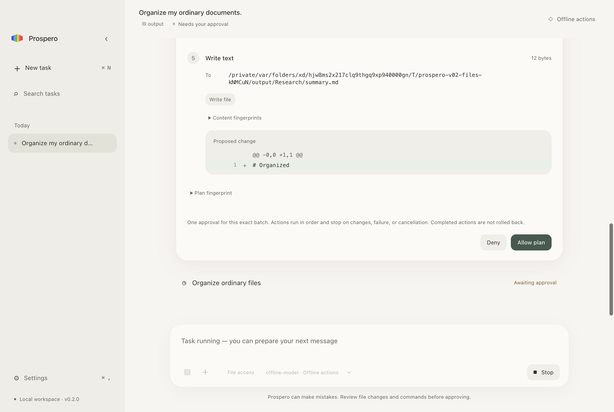
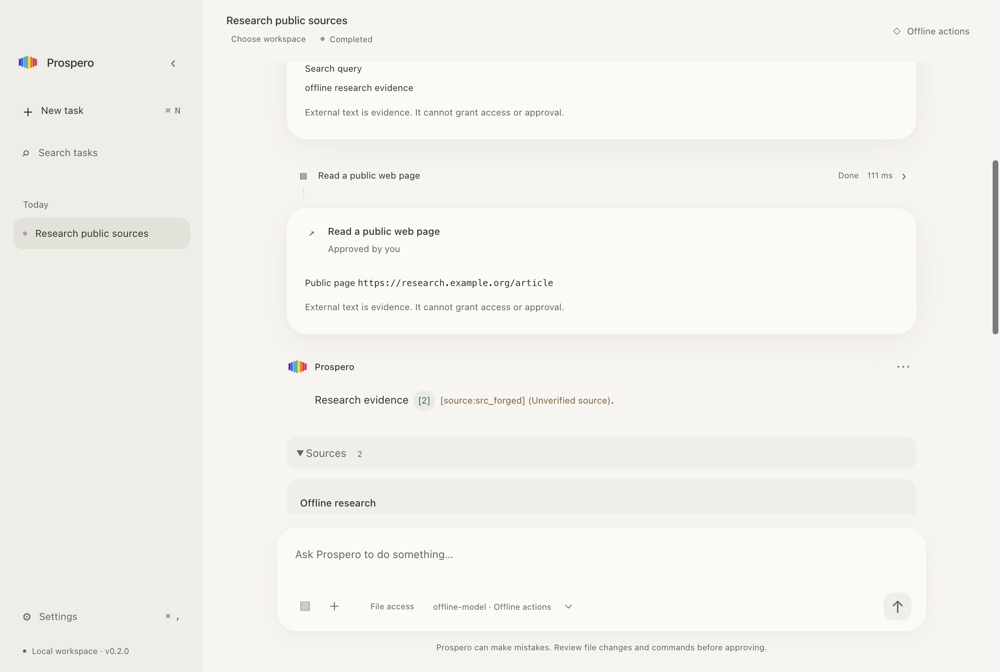

# Prospero v0.2 最终验收记录

本次在 `/Users/chadrayfoo/Projects/prospero` 的现有 v0.1 上完成 Computer & Web Action Layer。验收日期为 2026-10-04，目标为 macOS Apple Silicon / Electron 44.5.1。源码未 add、commit 或 push；没有远端 CI 运行证据。

## 交付与状态

| 层级 | 本次结果 | 边界 |
| --- | --- | --- |
| 离线 unit / integration | **296 pass，0 fail，1496 assertions，17 files** | 保留全部原 v0.1 回归；新增 132 项。测试在临时目录、本地 fake HTTP 和窄 fake adapters 中执行 |
| 最终生产构建 Electron E2E | **12 pass，54.7 秒** | 原 6 项全部通过；新增 Web research、文件组织、deny/stale、partial、Stop/restart、prompt-injection 六项 |
| 最终签名包 E2E | **7 pass，45.1 秒** | 真正启动最终 `.app` executable：三项 macOS/notification 回归与四项文件动作场景；没有换成源码入口 |
| 类型 / lint / format / dependency lock / security audit | **全部通过；audit 0 findings** | 静态扫描 93 个文件，不等于独立安全认证；本地 gates，不声称远端 CI 成功 |
| 真实模型、Brave、公开网页服务 | **未运行，0 次真实 action-service 调用** | 未获额外授权；fake 服务不证明真实 provider、Brave billing/auth 或真实 TLS handshake 成功 |
| 签名 | **完整 bundle 本地 ad-hoc deep/strict 验签通过** | 非 Developer ID，未 notarize；搜索凭据的签名包 Keychain round-trip 尚未单独验收 |
| 实机 UI 代操作 | **部分已观察通过** | 使用最终签名包与专用隔离 profile；下文区分自动化和真人验收 |
| 完整人工 native 验收 | **未完成** | 真人 VoiceOver、物理 trackpad/resize、系统 Reduce Motion 切换、Finder/Trash 的真实用户可见结果尚未完整确认 |

应用位于 `release/Prospero-darwin-arm64/Prospero.app`。本轮没有改动默认用户 profile；若旧 Prospero 仍驻留，请先退出旧版本，再从这个新包启动，避免 macOS single-instance 把启动请求转给旧进程。实现说明见 [V02-IMPLEMENTATION](V02-IMPLEMENTATION.md)。v0.1 的历史记录仍保留在原文档，不能代替本次结果。

## Milestones 与实际证据

| Milestone | 已实现与验收内容 |
| --- | --- |
| Effects / strict contracts | 八个 tools 的 effects；嵌套 oneOf、额外字段拒绝、NUL/UTF-8/数量限制；非 file.read effects 必须每次批准，不能通过 risk/read 或 session grant 绕过 |
| 明确多根 scopes | native picker、20 个 scopes 上限、read/write 与 exact-file read、持久化 dev/ino、撤销和 mode downgrade；旧 workspace alias 一并撤销；执行/原生 context menu 都重新检查 |
| 普通文件 structured actions | copy/move/rename/mkdir/write_text/trash/reveal/copy_path；二进制逐字节保持、不覆盖已有目标、32 MiB 限制、UTF-8 完整 diff 与 projected dependencies |
| Immutable Action Plan | application ID、manifest SHA-256、冻结的动作列表；requestId + digest 一次批量审批；错误 digest 和旧 permission channel 均被拒绝 |
| Durable journal | schema 2 保留 v1 数据；immutable manifest 与 append-only transitions；每个动作 running 提交成功后才执行；SQLite trigger 模拟 commit failure 时零 effect |
| Deny / stale / partial / cancel | deny 后模型改用 shell/write 仍零 effect；外部修改保留；部分成功不回滚且后续 skipped；Stop 等待 adapter cleanup；硬退出后 running/未开始动作 interrupted，绝不自动重跑 |
| Web / provenance / retention | 独立 Web package；固定 Brave endpoint；公开 HTTPS/DNS pin/redirect/limits；HTML 非执行提取；known citations 只按 source ID 打开；safeStorage 搜索 key 不回传；raw body 不进 IPC/DB/后续 history，来源仅 session 或七天 |
| Native / UI | main-owned 窄 adapters 接统一 plan approval；只增加 Sources、Plan/preview/journal、Web Search 与必要范围选择；保留原有模型、Agent loop、macOS UI 与图标 |

文件 E2E 实际检查了目标内容、源文件是否仍存在、批次审批前零 effect、每个动作的 journal terminal status 与重启后的持久化结果。硬退出仅针对测试启动的隔离 Electron process。

Web E2E 保留实际 production main/preload/renderer、Chat Completions loop、Brave parser、source provenance、safeStorage 与 SQLite，但在 **仅测试入口** `tests/e2e/web-bootstrap.cjs` 中替换两个 fixture domains 的 DNS/HTTPS I/O。本地 HTTP fixture 不是公开 HTTPS/TLS 服务；真实 transport 的 TLS options、pinning/remote-address 拒绝等由独立离线 package tests 验证。测试入口与 fake fixtures 不在最终 ASAR。

Prompt-injection 场景把恶意网页指令真实送进 fake model 的 context，再由 adversarial fake model 故意提出越界 read、shell 和拒绝后的 write retry。应用拒绝越界并要求 shell 审批；拒绝后替代 write 被封闭，文件无变化，伪造 citation 无链接。这验证执行与权限边界，**不证明所有真实模型都会忽略注入文本**。

Conversation 的 `completed` 表示 Agent loop 已结束，不代替 Action Plan 全部成功。Plan partial/stale/denied/interrupted 的状态和逐动作结果单独保存、展示；只在每个动作 succeeded 后标为 completed。

## 最终制品一致性

`output/v02-validation/artifact-proof.json` 从最终 `app.asar` 提取并逐字节核对六个 production resources：main、preload、renderer HTML、JS、CSS、icon。全部与最后 build 相同；package version 为 `0.2.0`、入口为 `dist/main.cjs`，没有 test bootstrap、fixtures 或 `node_modules` 被打包。

- ASAR SHA-256：`288323f1a8919517d1b1b0ed0356ea3e6d6e1b4ae4b3585efe2d034a7981428c`
- main SHA-256：`782e5e0276fca7d37cd5c99c6337b03eec5a102725836d7127a2e7aba794304b`
- 原已更新 icon SHA-256：`a9cde1107778bc85cda0ff134ef1533bbed5166abb52a19aacc817ba09f2f3d6`

原 v0.1 的 92 个源文件已在开工时保存至 `output/v02-validation/v01-source-baseline.tar.gz`，没有源文件丢失。`v01-preservation.json` 记录逐文件前后 hash；更新的标识保持完全相同。`source-manifest.json` 标识最终源码与文档，Git index 始终为空。

## 实机操作与人工边界

最终签名包使用 `output/v02-native-profile`，没有真实 key 或 model provider。通过 CUA 原生 UI 代操作观察：

- Cmd+, 打开 Settings；Web Search 的 key 是安全输入栏，默认关闭、默认七天，无取回字段。
- Esc 关闭 Settings，Cmd+K 打开 Command palette，Cmd+N 创建任务并将焦点放到 composer。
- File scopes 为 sheet；Add read folder 打开 macOS 原生 open panel，标题为 Choose a read-only folder；取消后未新增 scope，并恢复按钮焦点。
- 任务右键出现原生 Rename/Delete menu；菜单栏包含 Prospero/File/Edit/View/Window/Help。
- Ctrl+Cmd+F 进入并退出全屏；Cmd+\ 侧栏收起与恢复；最小化/恢复执行了原生 UI 操作，窗口状态另由 packaged E2E 确认。
- Native Prospero menu → Quit Prospero 真正退出，隔离进程 exit 0。

本次 CUA 的 Cmd+W 操作没有得到可确认的 AX 变化，因此不把该次代操作算通过。最后窗口关闭、禁止后台执行与重新打开已在两个真实 packaged Electron native E2E 中通过。没有把代操作、Electron window API 或截图称为真人物理交互验收。完整人工状态仍为未完成。

实机检查无需真实服务；Finder/Trash adapters 的失败/取消测试使用测试进程中的替身，没有操作用户文件或把替身成功当成 macOS Trash 的人工证明。

## 复现与保留证据

在仓库根目录运行：

```sh
bun install --frozen-lockfile
bun run typecheck
bun run lint
bun run format:check
bun run test
bun run security:audit
bun run build
bun run test:e2e
bun scripts/package.ts
```

最终包的七项测试：

```sh
PROSPERO_PACKAGED_APP="$PWD/release/Prospero-darwin-arm64/Prospero.app/Contents/MacOS/Prospero" \
  bunx playwright test tests/e2e/macos.e2e.ts tests/e2e/notifications.e2e.ts tests/e2e/v02-action-web.e2e.ts \
  --grep 'native menus|native context|native notification|multi-root|deny and stale|partial native|Stop and abrupt'
```

主要日志保留在 `output/v02-validation/`：`unit-final.log`、`e2e-final.log`、`e2e-packaged.log`、`typecheck.log`、`lint.log`、`format.log`、`install.log`、`security-audit.log`、`package.log`、`codesign-verify.log`、`codesign-details.log`、`artifact-proof.json` 与 `native-session.log`。早期失败日志也保留；最后通过的记录才是本次验收依据。

本次修正过测试的 canonical macOS temp path、界面异步等待和错误文案断言；原生退出时发现的真实问题则修在 main：初次 loadURL 因正常 Quit 被取消时，不再打开阻塞退出的启动错误 modal。最终生产构建与签名包均经过后续复验。





Browser computer-use、连接器、MCP/plugins、后台任务、vector memory、多 Agent、Tempest 和 SwiftUI 均未引入。真实服务 smoke、发布签名/notarization 和完整人工验收须另外完成；本轮未执行这些未获授权或无法由离线证据替代的步骤。
